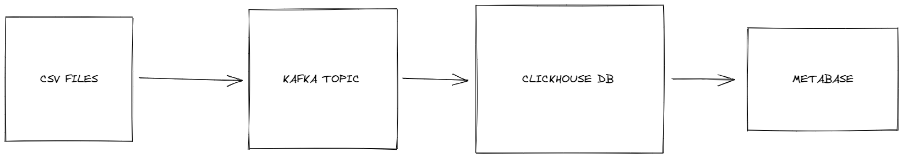

# Jobsity Data Engineer Challenge

## Overview

The Challenge was to create a data pipeline to process automatically csv files on a on-demand basis. The logic that I applied was the following:

- Python CLI to process any data stored a the `data` folder. The Script basically converts every single row into a kafka message.
- That data is sent to a Kafka Topic to be processed and then consumed into a ClickHouse DataBase, which is a columnar DB, very performatic for analytical data.
- Also took the freedom to instantiate a Metabase Server, to help the future analytical team

In order to make everything run smoothly, just make sure you have docker and docker compose installed and run `docker compose up`

Afterwards, if you want to test the process itself, run `python data-ingestion.py`

I couldn't run the entire process on my local machine because of disk/RAM, but in a cloud environment, the solution could easily scale up using more Kafka nodes. 

## Cloud Solution

The cloud solution wouldn't be so different. I'll just send the kafka topic directly into the Data Lake (S3, for instance) and later, would use the messages in Spark using EMR, but the final destination and the visualization tool would remain the same.

## Bonus questions

The answers are located in the `requested_queries.sql`.
